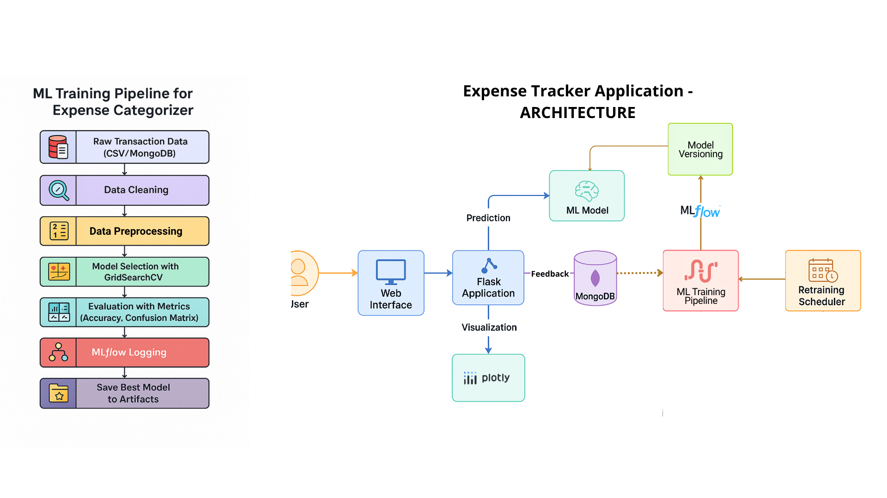
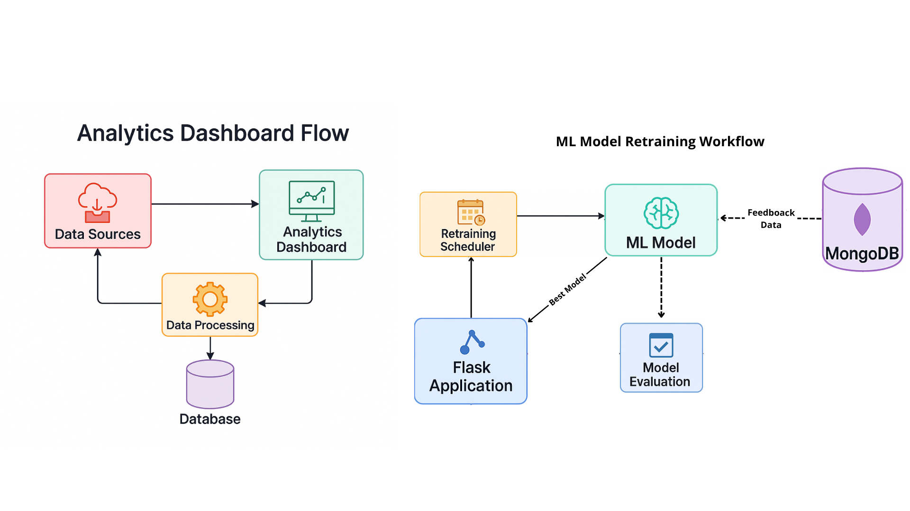
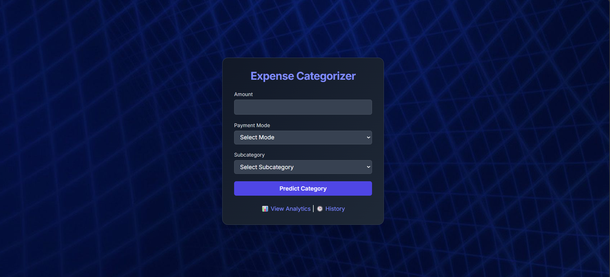
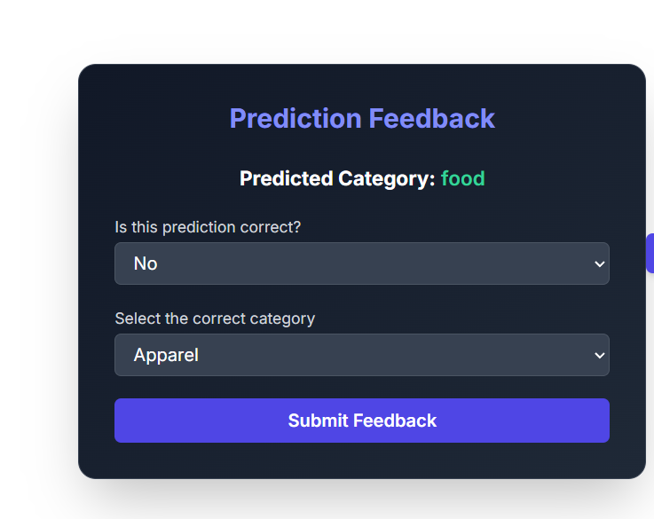
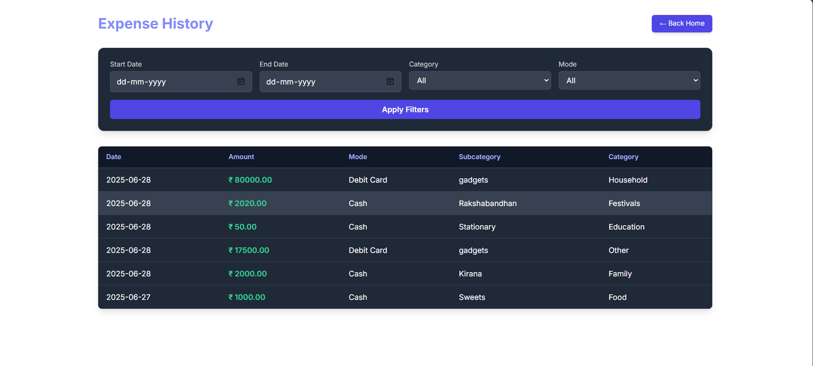
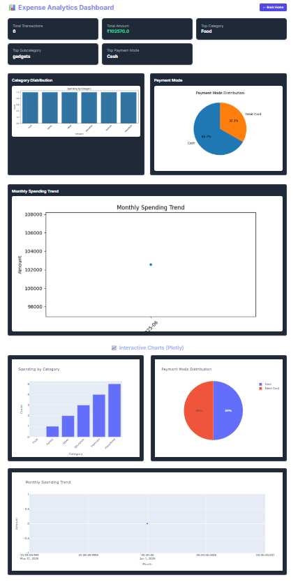

# 💸 Expense Categorizer - Smart Expense Classification and Tracking

A full-fledged Flask-based machine learning application that classifies financial transactions into meaningful categories, enables user feedback, stores data in MongoDB Atlas, tracks model performance with MLflow, visualizes insights with Plotly, and supports automated retraining.

---

## 📚 Table of Contents

- [Live Demo](#-live-demo)
- [System Diagrams](#system-diagrams)
- [Frontend](#frontend)
- [Features](#-features)
- [Project Structure](#-project-structure)
- [Tech Stack](#-tech-stack)
- [Problem Faced & Solutions](#-problem-faced--solutions-logged)
- [Routes](#-routes)
- [Environment Variables](#️-environment-variables-env)
- [Visualization](#-visualization-powered-by-plotly--seaborn)
- [How to Run](#️-how-to-run)
- [Future Plans](#-future-plans)
- [Contributing](#-contributing)
- [License](#-license)


## 🌍 Live Demo
👉 [Try it Live](https://expense-categorizer.onrender.com/)


# System Diagrams




---

# Frontend


---

---

---



## 🚀 Features

* 💡 ML-powered transaction categorization based on amount, subcategory, and mode
* 🔁 Real-time user feedback to refine model predictions
* 📊 Interactive analytics dashboard with Plotly & Matplotlib
* 🧠 Automated model retraining every 6 hours with APScheduler
* 🗃️ MongoDB Atlas integration for persistent feedback and prediction storage
* 🧪 MLflow for model tracking and experimentation
* 🔧 Modular architecture for scalability


## 🧱 Project Structure

```
expense-categorizer/
├── app.py                      # Main Flask application
├── src/
│   ├── pipeline/
│   │   ├── predict_pipeline.py      # Logic for model inference
│   │   └── train_pipeline.py        # Full training pipeline
│   ├── components/
│   │   ├── data_ingestion.py        # Loads, cleans, and validates raw data
│   │   ├── data_transformation.py   # Preprocessing, encoding, imputation
│   │   └── model_trainer.py         # Model training & selection
│   ├── services/
│   │   └── analytics_service.py     # Summary stats & visualizations
│   ├── utils.py                     # Utility functions (load/save objects)
│   └── exception.py                 # Custom exception handler
├── templates/
│   └── *.html                  # Frontend HTML templates
├── static/                     # Static assets like CSS and plots
├── .env                        # Environment variables (Mongo URI, DB name)
├── requirements.txt            # All dependencies
└── README.md                   # You're here.
```

## 🧰 Tech Stack

- **Backend**: Flask, APScheduler
- **ML**: Scikit-learn, MLflow
- **Database**: MongoDB Atlas
- **Visualization**: Plotly, Seaborn, Matplotlib
- **Deployment**: Not yet Deployed


[](https://expense-categorizer.onrender.com)


## 🔍 Problem Faced & Solutions (Logged)

### ✅ Data Handling

* **❌ Inconsistent Kaggle dataset** → ✅ *Generated synthetic data with realistic distributions for generalization and balanced class representation.*
* **❌ Path management issues (esp. on Windows)** → ✅ *Used `pathlib` instead of `os.path.join` for better cross-platform compatibility.*
* **❌ Subcategory NaNs** → ✅ *Built a custom `SubcategoryImputer` transformer to fill NaNs using related categories.*
* **❌ Rare subcategories led to poor performance** → ✅ *Grouped rare subcategories into an 'Other' class.*

### ✅ Model Training

* **❌ Class imbalance affecting model** → ✅ *Used `compute_sample_weight` to penalize dominant classes.*
* **❌ Pipeline rerun for every test** → ✅ *Designed a `TrainPipeline` class for end-to-end training abstraction.*
* **✅ ML model tracking** → *Used MLflow to log experiments, metrics, and models.*
* **✅ Auto-retraining** → *Used `APScheduler` to retrain model every 6 hours using `schedule_model_training()`.*

### ✅ Integration

* **✅ Database** → *Used MongoDB Atlas to persist user feedback instead of flat CSVs.*
* **✅ Interactive Dashboards** → *Used Plotly for drill-down and dynamic charts (category, mode, trend).*


## 🌐 Routes

| Endpoint     | Description                                              |
| ------------ | -------------------------------------------------------- |
| `/`          | Main UI to predict expense category                      |
| `/predict`   | POST route for submitting transaction data               |
| `/feedback`  | Submit feedback and correct category (stored in MongoDB) |
| `/analytics` | Displays analytics from feedback data                    |
| `/history`   | Filterable table to view all transactions                |


## ⚙️ Environment Variables (.env)

```
MONGO_URI=mongodb+srv://<user>:<pass>@cluster.mongodb.net
MONGO_DB_NAME=expense-tracker
MONGO_COLLECTION_NAME=feedback
```


## 📊 Visualization (Powered by Plotly & Seaborn)

* Category-wise expense distribution
* Mode of payment usage
* Monthly expense trends


## 🛠️ How to Run

```bash
# Clone repository
$ git clone https://github.com/yourusername/expense-categorizer.git

# Create virtual environment and install packages
$ pip install -r requirements.txt

# Add .env with Mongo URI

# Run Flask app
$ python app.py
```


## 🔮 Future Plans

* Add user authentication
* Income tracking & budget planning
* OCR-based bill reading
* Mobile-first responsive design


## 🤝 Contributing

Pull requests are welcome. For major changes, please open an issue first to discuss what you'd like to change.


## 📜 License

This project is licensed under the [MIT License](LICENSE).


---
> This app is a blend of ML engineering + full stack application development — not just an ML model showcase but a production-ready system in the making.

---
> 💼 Built with ❤️ by [Keshav Jangid](https://github.com/ksv-py)
